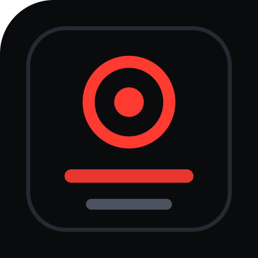
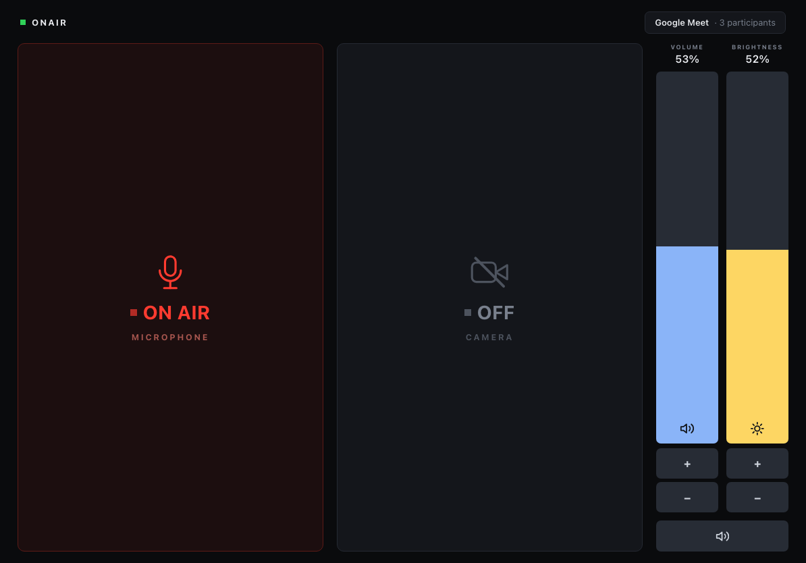

# onair

Turn a spare tablet or phone into a physical control panel for your computer's
microphone and camera. It sits beside your display, always on, and answers one
question at a glance: **am I live right now?**

Mic and camera drive the meeting app's own controls, so other participants see
the change — Google Meet, Microsoft Teams and Zoom. Display brightness, output
volume and mute come along too.

There is no cloud service and no account. The agent runs on your own machine and
serves the panel over your local network. Nothing leaves your network.



```
  ┌──────────────────────┐            ┌───────────────────────────┐
  │  iPad / Android /    │   LAN,     │  agent on your Mac or PC  │
  │  any browser         │◄──────────►│  menu-bar / tray icon     │
  │  (added to the home  │  bearer    │  drives mic, camera,      │
  │   screen as an app)  │  token     │  brightness, volume       │
  └──────────────────────┘            └───────────────────────────┘
```

---

## Install

### The agent, on the computer you want to control

**macOS** — one command:

```sh
git clone https://github.com/abhyaung/onair-control-panel
cd onair-control-panel/agent-macos
./install.sh
```

It builds, signs, installs to `/Applications`, launches, and opens the one
settings pane you have to click yourself. Needs the Xcode command line tools
(`xcode-select --install`) — nothing else.

**Windows** — not built yet. See [`agent-windows/`](agent-windows/) for the
API notes if you want to write it.

> **Why there is no download.** macOS refuses to let an *unsigned* app hold
> Accessibility for the processes it launches, so a downloaded unsigned build
> fails **silently** — every control looks fine and changes nothing. Building
> locally creates a stable signing identity, which also means the permission
> survives rebuilds. A prebuilt, notarised app needs a paid Apple Developer ID.

### Two permissions, once

1. **Accessibility** — System Settings → Privacy & Security → Accessibility →
   add **OnAir**. The installer opens this pane for you.
2. **Chrome → View → Developer → Allow JavaScript from Apple Events** — must be
   clicked by hand; it shows a confirmation dialog.

Run `make doctor` any time for a report on every permission and dependency.

### The panel, on your tablet

Menu-bar **◉** → **Pair iPad (QR code)** → scan it with the tablet's camera →
tap the notification. The panel opens and works immediately; the token travels
in the link, so there is nothing to type.

Then add it to the home screen, so it runs full-screen and keeps the display
awake:

- **iPhone / iPad** — **Share** → **Add to Home Screen**.
  In Chrome the option is behind **Share → More**.
- **Android** — tap the **Install** button the panel offers.

> **Pair each browser once.** The token is stored per browser, and an installed
> home-screen app counts as its own browser on iOS. If a panel says it is not
> paired, open the QR link again — that is all it needs.

## Using it

**The two big tiles are mic and camera.** Red and pulsing means you are live;
dark means you are off. Tap to toggle.

In a meeting, these press the meeting app's *own* buttons, so everyone else sees
you mute or stop video exactly as if you had clicked in the app. Outside a
meeting, the mic tile mutes every input device on the machine.

**A third state matters: `NO SIGNAL` in amber.** It means the panel cannot tell —
no meeting open, or the browser cannot be reached. It is deliberately different
from "off", because a panel that guesses is worse than one that admits it does
not know.

**The right-hand faders are volume and brightness.** Drag anywhere on them —
they move by how far you slide, not to where you touch, so brushing past does
nothing. The **+** and **−** buttons step by exactly 1%. The wide button
underneath mutes output.

A fader that appears dimmed with a caption is telling you that control is
read-only on your current setup, and why. The status line at the top names the
meeting you are in, and shows a warning when something needs attention.

---

## If something is not working

| Symptom | Cause |
|---|---|
| Panel says "not paired" | that browser has no token — open the QR link again |
| Meeting controls do nothing | Chrome's *Allow JavaScript from Apple Events* is off |
| Volume/brightness read-only | Accessibility not granted, or MonitorControl not running |
| Nothing responds at all | the agent is not running — check for **◉** in the menu bar |

`make doctor` diagnoses all of these and links to the right settings pane.

---

## Design notes

**Red means live.** Broadcast on-air convention: red is "you are being heard or
seen", dark is safe. From across a desk the panel answers *am I hot right now?*,
so hot is the loud state.

**State comes from the operating system, not the web page.** Mic state
enumerates every input device — muting only the default one silences a
microphone nobody is using while the app records from another. Camera state
comes from the OS capture API, so it stays correct no matter what changed it.

**Every control has three states, never two.** On, off, and *unknown*. A control
that is readable but not settable renders read-only with the reason. A panel
that displays the wrong state is worse than no panel.

**The client sends action ids, never commands.** Every action is defined
server-side; no input from the panel reaches a shell.

---

## Layout

```
panel/           the web app — shared verbatim by every agent
protocol/        API.md, the contract; default config
agent-macos/     Python agent + Swift menu-bar app
agent-windows/   not built yet
docs/            architecture, UI mockup
```

[`protocol/API.md`](protocol/API.md) is the contract between the panel and any
agent. Implement it and the panel works unchanged. It also records the mistakes
worth not repeating — the ones that cost real time to find.

## Licence

MIT — see [LICENSE](LICENSE).
